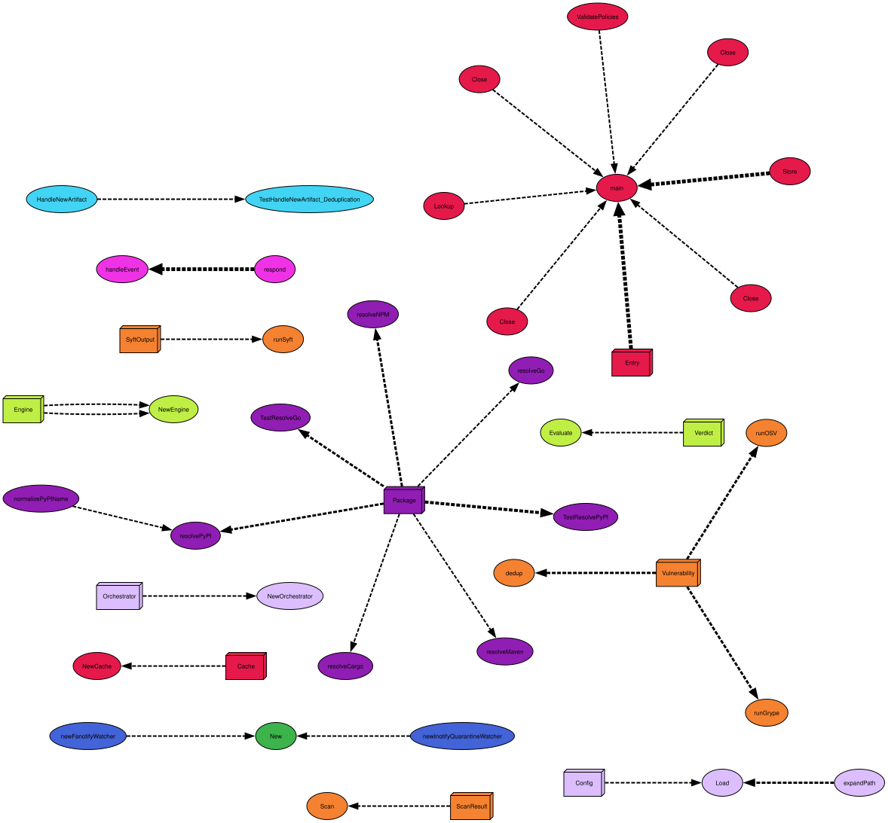

# gated

Supply chain gate daemon. Intercepts package manager installs at the OS level,
scans artifacts with syft/grype/osv-scanner, evaluates OPA policies, and blocks
packages that violate license, vulnerability, or provenance rules.

No wrappers. No symlinks. No devcontainer. One binary, any ecosystem.

## How it works

```
pip install requests
    │
    ▼
 [pip downloads wheel to ~/.cache/uv/...]
    │
    ▼
 [gated intercepts the file operation]
    │
    ├─ verdict cache hit → allow / deny immediately
    │
    └─ cache miss → resolve package identity from path
                  → syft (SBOM + license) + grype + osv-scanner (vulns)
                  → OPA policy evaluation
                  → cache verdict
                  → allow / deny
    │
    ▼
 [pip continues or fails]
```

## Visualisation


The interception mechanism adapts to the platform and available privileges:

| Mode | Platform | Mechanism | Privileges | Guarantee |
|------|----------|-----------|------------|-----------|
| `fanotify` | Linux | Kernel permission events | `CAP_SYS_ADMIN` | Synchronous. Process frozen in kernel space. Zero race window. |
| `quarantine` | Linux, macOS | inotify/FSEvents + atomic rename | None | Near-synchronous. File quarantined before package manager reads it. |

On Linux with `watcher_mode: auto` (default), gated probes for fanotify capability
at startup and falls back to inotify+quarantine transparently. Same binary, same
policies, same scans.

## Quick start

### Developer workstation (no root)

```bash
git clone https://github.com/internal/gate-daemon.git
cd gate-daemon

# Install scan tools to ~/.local/bin.
./scripts/install-user.sh

# Or build and install manually:
make build
./gated -config configs/config.user.yaml
```

### System-wide (CI runners, shared build machines)

```bash
make build
sudo make install
sudo make install-config
sudo make install-systemd

# Edit watch paths and policy directory.
sudo vim /etc/gated/config.yaml

# Start.
sudo systemctl enable --now gated
sudo journalctl -u gated -f
```

## Build

```bash
make build             # native platform
make build-all         # linux/amd64, linux/arm64, darwin/amd64, darwin/arm64, windows/amd64
make test              # unit tests with race detector
make check             # build + validate policies + vet
make tidy              # go mod tidy
```

Version is injected at build time via `-ldflags`:

```bash
./gated -version
# gated v0.3.0 (commit=a1b2c3d, built=2026-05-09T20:00:00Z, linux/amd64)
```

## Configuration

Two example configs are provided:

| File | Use case |
|------|----------|
| `configs/config.example.yaml` | System-wide, fanotify or auto mode |
| `configs/config.user.yaml` | Developer workstation, quarantine mode, everything under `$HOME` |

Key settings:

```yaml
watcher_mode: auto          # auto | fanotify | quarantine
warn_only: true             # log denials but allow everything (rollout mode)
scan_timeout_seconds: 30    # kill scans that hang
```

### Watch paths

Each entry maps a filesystem path to a package ecosystem:

```yaml
watch_paths:
  - path: ~/.cache/uv
    ecosystem: pypi
  - path: ~/go/pkg/mod/cache
    ecosystem: go
  - path: ~/.m2/repository
    ecosystem: maven
  - path: ~/.cargo/registry
    ecosystem: cargo
```

### Ecosystem support

| Ecosystem | Cache artifacts resolved | PURL format |
|-----------|------------------------|-------------|
| PyPI | `.whl`, `.tar.gz` | `pkg:pypi/name@version` |
| Go | `@v/*.zip`, `@v/*.mod` | `pkg:golang/module@version` |
| Maven | `*.jar` | `pkg:maven/group/artifact@version` |
| Cargo | `*.crate` | `pkg:cargo/name@version` |
| npm | `*.tgz` (best-effort) | `pkg:npm/name@version` |

npm's content-addressed cache (`_cacache`) makes path-based resolution unreliable.
For full npm coverage, watch `node_modules/` instead.

## Policies

Policies are OPA Rego files in the `policy/` directory. They share a common
interface: any rule producing a string in `data.gate.deny` causes the package
to be blocked.

### license.rego

Allowlist-based SPDX enforcement. Packages with blocked licenses (AGPL, SSPL,
BUSL, Elastic-2.0) are denied. Packages with no detected license are denied
(unknown obligation = unacceptable risk).

### vulnerability.rego

Severity-gated with nuance:

- Critical severity: always denied.
- High severity + CVSS ≥ 9.0: always denied.
- High severity + fix available: denied (upgrade available, no excuse).
- Medium severity + in CISA KEV list: denied (actively exploited).
- Total vulnerability count exceeds threshold: denied.

### provenance.rego

Supply chain origin checks:

- Explicit blocklist of known-malicious packages (typosquats, compromised versions).
- Configurable typosquat name patterns per ecosystem.
- Maven `groupId` namespace allowlist.
- Go module host prefix allowlist.
- Optional: deny packages where scan tools errored (`require_clean_scan`).

### Tuning

Edit `policy/data.json` to adjust approved licenses, blocked packages, namespace
rules, CISA KEV CVEs, and vulnerability thresholds. After editing, reload:

```bash
# System service
sudo systemctl reload gated

# User service
systemctl --user reload gated

# Manual
kill -HUP $(pidof gated)
```

SIGHUP re-validates policies and invalidates the verdict cache.

## Deployment

### systemd

Three unit files in `init/systemd/`:

| Unit | Runs as | Mode | Use case |
|------|---------|------|----------|
| `gated.service` | root | fanotify | CI runners, shared machines |
| `gated-unprivileged.service` | `gated` (service user) | quarantine | Server, no root desired |
| `gated-user.service` | your UID | quarantine | Developer workstation |

### Distribution via Artifactory

Binary to a generic repo, policies as a separate versioned tarball:

```
internal-tools-generic/
├── gated/
│   ├── v0.3.0/
│   │   ├── gated-linux-amd64
│   │   ├── gated-linux-arm64
│   │   ├── gated-darwin-amd64
│   │   ├── gated-darwin-arm64
│   │   └── config.example.yaml
│   └── latest -> v0.3.0
└── gated-policy/
    └── v0.3.0/
        └── policy.tar.gz
```

Policies change independently of the binary — different cadence, different owners.

## Architecture

```
cmd/gated/main.go          Entry point, wiring, signal handling
internal/
├── config/                 YAML config loader with ~ and $ENV expansion
├── watcher/
│   ├── watcher_iface.go          Watcher interface + Config struct
│   ├── watcher_linux_new.go      Auto-detection: fanotify vs inotify
│   ├── watcher_linux_fanotify.go Kernel-enforced synchronous gate
│   ├── watcher_linux_inotify.go  Unprivileged inotify + quarantine
│   ├── watcher_darwin.go         FSEvents + quarantine (CGo)
│   └── watcher_windows.go        Stub (three strategies documented)
├── quarantine/             Atomic rename gating (cross-platform)
├── resolver/               Path → (ecosystem, name, version) mapping
├── scanner/                Orchestrates syft, grype, osv-scanner
├── policy/                 OPA evaluation engine
└── verdict/                Filesystem-backed verdict cache
```

### Design decisions

**fanotify over eBPF.** fanotify permission events provide synchronous allow/deny
without modifying the target process. eBPF `cgroup/connect4` can intercept
connections but can't block-and-resume a file open.

**Quarantine as universal fallback.** Atomic rename works on every OS and needs no
privileges. The race window (file exists briefly before quarantine) is academic
for package managers — they always close a download before opening for extraction.

**Fail open on errors.** If a scan tool crashes or OPA eval fails, the artifact is
allowed. Logged and recorded in the verdict cache for audit. The daemon never
becomes a single point of failure.

**Filesystem verdict cache.** Zero dependencies. In-memory map for sub-microsecond
hot-path lookups, JSON files on disk for persistence across restarts. 24h
auto-pruning.

**SIGHUP policy reload.** Change policies in production without restart. Verdict
cache is invalidated on reload.

## Scan tools

gated shells out to three tools, all Apache-2.0 licensed. Policy evaluation
(OPA/Rego) runs in-process via the OPA Go SDK — no external `opa` binary
required.

| Tool | Purpose | Project |
|------|---------|---------|
| [syft](https://github.com/anchore/syft) | SBOM generation, license detection | Anchore |
| [grype](https://github.com/anchore/grype) | Vulnerability scanning | Anchore |
| [osv-scanner](https://github.com/google/osv-scanner) | OSV advisory cross-reference | Google |

Install all three with `./scripts/install-tools.sh` (system-wide) or
`./scripts/install-user.sh` (per-user to `~/.local/bin`).

## Limitations

- macOS build requires CGo (`CGO_ENABLED=1`) for CoreServices FSEvents binding.
  Cross-compiling from Linux needs `osxcross` or build natively on a Mac.
- fanotify watches are per-mount, not per-directory (kernel limitation); the daemon
  filters by path prefix in userspace.
- Scan latency adds to install time. Mitigated by pre-scan on file close (fanotify
  `FAN_CLOSE_WRITE`), quarantine during download-to-open gap, and verdict caching.
  First-time installs of large dependency trees will be noticeably slower.
- npm's content-addressed cache is poorly suited to path-based package resolution.
- Windows watcher is a stub. Three implementation strategies are documented in
  `watcher_windows.go` (ReadDirectoryChangesW, minifilter driver, ProjFS).

## License

Apache-2.0. See [LICENSE](LICENSE).
